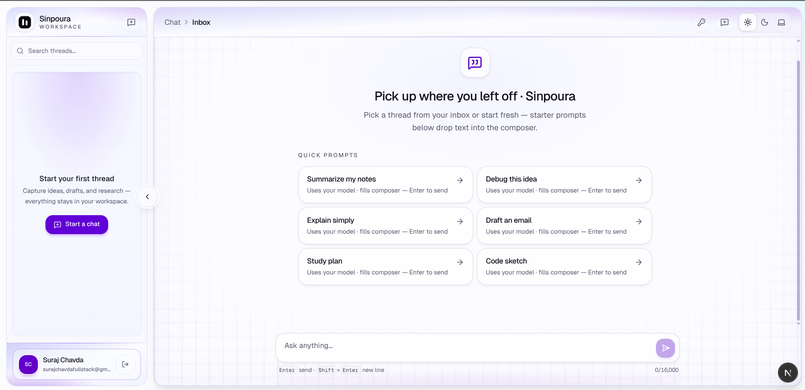
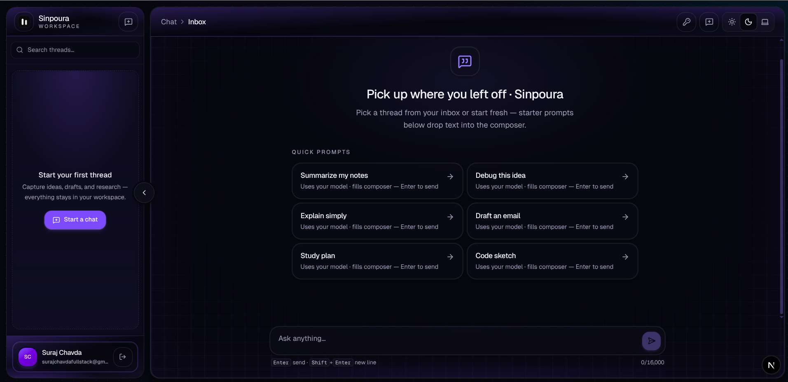

<p align="center">
  
</p>

<h1 align="center">Sinpoura</h1>

<p align="center">
  Open-source, multi-purpose AI chat built with <a href="https://nextjs.org/">Next.js</a>,
  <a href="https://www.mongodb.com/">MongoDB</a>, and
  <a href="https://github.com/kanha95/xoin-js">xoin-js</a> — a compact LLM client that speaks OpenAI and Anthropic from one API shape.
</p>

<p align="center">
  Built for <strong>live demos and day-to-day use</strong> — this repo is <strong>not</strong> positioned as a portfolio-only showcase. Use it as an internal tool starter or reference layout for App Router apps with real persistence and a responsive chat UI.
</p>

<p align="center">
  <a href="https://github.com/kanha95/xoin-js"
    ></a>
  <a href="./LICENSE"
    ></a>
  
  <a href="https://www.npmjs.com/package/@xoin/xoin-js"
    ></a>
  <a href="https://github.com/kanha95/xoin-js"
    ></a>
</p>

<p align="center">
  <a href="https://nextjs.org/">Next.js App Router</a>
  ·
  <a href="https://react.dev/">React 19</a>
  ·
  <a href="https://www.mongodb.com/">MongoDB</a>
  ·
  <a href="https://github.com/pmndrs/zustand">Zustand</a>
  ·
  <a href="https://authjs.dev/">Auth.js</a>
  ·
  Tailwind CSS v4
</p>

## Live demo (testing)

**Demo URL:** [https://suraj-chavda-sinpoura-ai-multi-purpose-nextjs-a8b3r1cw7.vercel.app/](https://suraj-chavda-sinpoura-ai-multi-purpose-nextjs-a8b3r1cw7.vercel.app/)

The app also references this hostname as `DEMO_APP_URL` in `src/lib/constants.ts` — update **both** places if the deployment URL changes.

Use this deployment to **try registration, chat, and BYOK** without cloning the repo. Treat it as a shared test environment (data and uptime are best-effort).

### Documenting deploy URLs in Git

- Keep **one canonical link** in the README (here) and update it when your production hostname or Vercel alias changes.
- **Preview URLs** can churn; prefer a **production deployment or custom domain** when sharing outside quick tests.
- Label the environment (**testing / demo**) so visitors know accounts may reset and behavior depends on server env vars.
- **Never commit** secrets; linking the URL is fine — keys stay in the host dashboard only.

### What is xoin?

**xoin** is the small LLM client abstraction implemented by **[xoin-js](https://github.com/kanha95/xoin-js)** (`@xoin/xoin-js` on npm). Instead of wiring separate SDK shapes per vendor, you call one **`generate`**-style API while **xoin-js** routes to **OpenAI**, **Anthropic**, or other providers. Sinpoura constructs a fresh xoin client per chat request on the server — see [Why xoin-js sits at the center](#why-xoin-js-sits-at-the-center).

---

## Preview

Desktop workspace: sidebar with conversations, framed chat panel, transcript with avatars, composer, and quick prompts on an empty thread.

<p align="center">
  
</p>

<p align="center"><sub>Light theme</sub></p>

<p align="center">
  
</p>

<p align="center"><sub>Dark theme</sub></p>

---

## Table of contents

1. [Live demo (testing)](#live-demo-testing)
2. [Preview](#preview)
3. [Why Sinpoura exists](#why-sinpoura-exists)
4. [Why xoin-js sits at the center](#why-xoin-js-sits-at-the-center)
5. [Who this is for](#who-this-is-for)
6. [Features](#features)
7. [Responsive design and UX](#responsive-design-and-ux)
8. [Tech stack](#tech-stack)
9. [Repository layout](#repository-layout)
10. [Getting started](#getting-started)
11. [Environment variables](#environment-variables)
12. [How API keys work (server vs browser)](#how-api-keys-work-server-vs-browser)
13. [Scripts](#scripts)
14. [SEO, sharing, and discoverability](#seo-sharing-and-discoverability)
15. [Deployment](#deployment)
16. [Security notes](#security-notes)
17. [Customizing the product](#customizing-the-product)
18. [Acknowledgments](#acknowledgments)
19. [License](#license)

---

## Why Sinpoura exists

Most “AI chat demos” stop at a textarea and a fetch call. Sinpoura is closer to something you could actually ship: people **sign up**, **sign in**, conversations **live in MongoDB**, and every reply is produced through a **typed server route** that owns history, validation, and the LLM call.

The UI is intentionally finished enough to demo — sidebar, transcripts, quick prompts, model settings, dark mode — without pretending to be a full SaaS. You get readable structure (`features/chat` beside presentational components) so you can extend or rip pieces out without fighting the codebase.

---

## Why xoin-js sits at the center

Sinpoura uses [xoin-js](https://github.com/kanha95/xoin-js) (`@xoin/xoin-js` on [npm](https://www.npmjs.com/package/@xoin/xoin-js)) to talk to language models. In this repo, wiring lives in `src/server/ai/xoin.ts`: we build a fresh xoin instance per request with either OpenAI or Anthropic providers and models driven by environment defaults.

That matters for three practical reasons:

1. **One mental model** — you’re not maintaining two completely different SDK shapes for two vendors.
2. **Easy to extend** — xoin-js is built around pluggable providers; adding another backend later mostly touches server-side factory code.
3. **Honest boundaries** — keys either come from env (host-owned) or from the user’s browser (BYOK), and xoin runs where those keys are resolved, not leaked into random client bundles.

If you’re explaining the architecture, call out **xoin-js** explicitly: it keeps vendor-specific SDK details behind one server-side abstraction instead of scattering provider logic across routes.

---

## Who this is for

- **Demo testers & evaluators** — Try the [live demo](#live-demo-testing) or run locally with your own keys and database.
- **Internal tools** — Swap branding, tighten RBAC, add org models; the conversation CRUD and API route are a sane spine.
- **Learning App Router + Zustand** — Feature slice pattern with hooks, store, and UI separated.
- **Teams comparing BYOK vs hosted keys** — The app supports env keys for guests on your deployment and browser-stored keys for power users (details below).

---

## Features

### Accounts and access

- Email + password **registration** and **credentials sign-in** (Auth.js v5).
- Sessions power protected routes; `/chat` stays behind auth middleware.

### Conversations and messages

- **Sidebar**: compact thread list with delete-in-row actions, new chat, mobile drawer on small screens.
- **CRUD**: create threads, list them, delete them, load messages per conversation.
- **URL sync**: active thread tracks `/chat?c=<conversationId>` so reloads and sharing the URL reopen the same chat when appropriate.

### AI / LLM layer (via xoin-js)

- Single **`POST /api/chat`** route: validates input, checks ownership, persists user message, loads history, calls **xoin `generate`**, stores assistant reply, returns both rows.
- **OpenAI** and **Anthropic** supported on the server (`createOpenAIProvider` / `createAnthropicProvider`).
- **Resolution order**: if `OPENAI_API_KEY` or `ANTHROPIC_API_KEY` is set on the server, that wins. Otherwise the client may send a **browser-managed key** with each request (never stored in MongoDB).

### Workspace UX

- **Model & API keys** dialog: pick provider, paste key (stored in **localStorage** only), save — keys travel over HTTPS with chat requests only.
- **Quick prompts** on empty threads: tap a card to **fill the composer** (not auto-send); edit, then send.
- **Processing state** with rotating captions while the assistant responds.
- **Avatars**: Sinpoura logo beside assistant rows; user initials chip beside yours (from session name/email).
- **Theme**: light / dark / system via next-themes.

### Developer experience

- **Zustand** store + hooks under `src/features/chat/` (bootstrap, route sync, send mutex, duplicate-send guards).
- **Zod** on API and auth payloads.
- **YAML-backed** system prompt template for the assistant (`src/server/ai/templates/`).

---

## Responsive design and UX

The layout is built for **phones, tablets, and desktops**, not only wide monitors.

- **Viewport lock on small screens** — The chat shell uses the dynamic viewport height so the **composer stays visible** instead of being pushed below the fold when the transcript grows.
- **Flexible transcript column** — Scroll lives inside the message region; padding ramps from mobile (`px-4`) through tablet (`sm:px-5`) to desktop (`md:px-6`) so bubbles don’t hug the bezel.
- **Safe areas** — Composer bottom padding respects `env(safe-area-inset-bottom)` where available (home indicator devices).
- **Header / breadcrumb** — Long conversation titles **truncate with ellipsis** instead of overflowing under the toolbar; the header flex chain uses `min-w-0` so truncation actually works.
- **Sidebar** — Desktop: collapsible rail; mobile: **slide-over drawer** with backdrop.
- **Touch-friendly** — Starter tiles and composer targets respect typical tap sizes.

Framed panel chrome (border, grid accent, glow under the composer) is tuned for **md+**; mobile stays fast and readable without squeezing content.

---

## Tech stack

| Layer | Choice |
| ----- | ------ |
| Framework | Next.js 16 (App Router) |
| UI | React 19, Tailwind CSS v4 |
| Client state | Zustand |
| Auth | Auth.js / `next-auth` v5 (credentials) |
| Database | MongoDB + Mongoose |
| LLM | `@xoin/xoin-js` (OpenAI + Anthropic providers) |
| Validation | Zod |
| Theming | next-themes |

---

## Repository layout

```
src/
├── app/                  # Routes, API routes, sitemap, robots, OG image
├── components/           # Layout, chat UI, theme, SEO JsonLd
├── features/chat/        # Store, hooks, API client, types
├── lib/                  # Constants, browser LLM config helpers, site URL, etc.
├── server/               # Mongo models, xoin factory, prompt loading
├── auth.config.ts        # Edge-safe Auth (middleware)
├── auth.ts               # Full Auth + credentials (Node)
└── middleware.ts         # Session-aware routing

public/logo.svg           # Brand mark (metadata + README)
```

---

## Getting started

You’ll need **Node.js 20+**, a **MongoDB** URI, and an **AUTH_SECRET**. LLM access is easiest with **`OPENAI_API_KEY`** or **`ANTHROPIC_API_KEY`** in `.env.local`; alternatively users can paste keys in the app (browser only).

```bash
cp .env.example .env.local
# Edit .env.local — see table below

npm install
npm run dev
```

Open `http://localhost:3000`, register, then visit `/chat`.

Generate a secret:

```bash
openssl rand -base64 32
```

### Troubleshooting

- Middleware must not import Mongoose or bcrypt — Node-only auth stays in `auth.ts`; `auth.config.ts` stays edge-safe.
- Turbopack monorepo quirks: `next.config.js` sets `turbopack.root` to this folder so builds resolve from the repo root.
- **`querySrv EBADNAME _mongodb._tcp.#…` on Vercel**: Almost always a broken **`MONGODB_URI`** — commonly an unencoded **`#`** in the DB password (the URI is truncated at `#`). Fix: paste the URI from MongoDB Atlas, or encode `#` → `%23`, `@` → `%40`, etc., then redeploy.

---

## Environment variables

| Variable | Required | Purpose |
| -------- | -------- | ------- |
| `AUTH_SECRET` | Yes | Session signing for Auth.js |
| `AUTH_URL` | Deploy | Canonical app URL (e.g. `http://localhost:3000`) |
| `SITE_URL` | No | SEO canonical URL; falls back to `AUTH_URL` |
| `NEXT_PUBLIC_SITE_URL` | No | Optional client-visible absolute URL |
| `MONGODB_URI` | Yes | Mongo connection string. Prefer Atlas “Connect → Drivers” paste (**credentials are pre-encoded**). If you assemble it by hand, percent-encode `#`, `@`, `/`, `:`, etc., or DNS fails with `querySrv EBADNAME`. |
| `OPENAI_API_KEY` | No | Server-side OpenAI key for xoin-js |
| `ANTHROPIC_API_KEY` | No | Server-side Anthropic key for xoin-js |
| `OPENAI_MODEL` | No | Defaults to `gpt-4.1-mini` in server factory |
| `ANTHROPIC_MODEL` | No | Defaults to Claude Haiku in server factory |

Never commit `.env.local`.

---

## How API keys work (server vs browser)

There are two supported stories — you can use either or both:

1. **Hosted / server keys** — Set `OPENAI_API_KEY` and/or `ANTHROPIC_API_KEY` in the environment. Every signed-in user shares those quotas (fine for demos and internal tools). The `/api/user/llm-config` route only exposes booleans: whether env keys exist.

2. **Bring-your-own-key (BYOK)** — If neither env key is set, users open **Model & API keys** and save a provider + key. That payload lives in **`localStorage`** in the browser under a versioned key. When they send a chat message, the client attaches `llm: { provider, apiKey }` to **`POST /api/chat`** over HTTPS. The server **does not persist** those credentials; it resolves keys per request in `resolveChatLlm` and builds a fresh xoin client for that call.

That design keeps Mongo free of raw API secrets while still allowing **real multi-provider LLM calls** through **xoin-js** when users bring their own keys.

---

## Scripts

| Command | Description |
| ------- | ----------- |
| `npm run dev` | Dev server (Turbopack) |
| `npm run build` | Production build |
| `npm run start` | Serve production output |
| `npm run typecheck` | TypeScript check |

---

## SEO, sharing, and discoverability

This README is written so humans scanning GitHub *and* search snippets get a clear picture: **Next.js AI chat**, **MongoDB persistence**, **Auth.js**, **Zustand**, **OpenAI**, **Anthropic**, **xoin-js**, **responsive**, **open source**, **MIT**.

In the app itself:

- **`metadataBase`, titles, descriptions, keywords** in `src/app/layout.tsx`
- **Per-route metadata** for login, register, chat (`robots: noindex` on chat by default so login walls don’t clutter SERPs)
- **`opengraph-image.tsx` / `twitter-image.tsx`** — 1200×630 share image
- **`JsonLd.tsx`** — JSON-LD `WebApplication` structured data
- **`sitemap.ts` / `robots.ts`** — public routes indexed; `/api/` and `/chat` disallowed from crawling by default
- **`manifest.ts`** — install / PWA-style manifest pointing at `logo.svg`

Before launch: set `SITE_URL` / `AUTH_URL` to `https://your-domain.com`, verify OG URLs in production, submit `sitemap.xml` in Search Console.

---

## Deployment

Typical path (e.g. Vercel):

1. Provision MongoDB Atlas (or compatible).
2. Set env vars from the table above.
3. Run `npm run build` in CI or rely on the host build step.

Match production hostname to `AUTH_URL` / `SITE_URL` so redirects and social preview URLs stay correct.

The **testing demo** linked [above](#live-demo-testing) is one such deployment; refresh the README URL if that hostname changes.

---

## Security notes

- Prefer **HTTPS** everywhere in production.
- **Browser BYOK** means anyone with physical access to the unlocked browser profile could read `localStorage`. Treat shared machines accordingly.
- **Rate limiting, CAPTCHA, abuse dashboards** are not included — add them before a wide public launch.
- Rotate **`AUTH_SECRET`** deliberately; it invalidates existing sessions.

---

## Customizing the product

- Product name: `src/lib/constants.ts` (`APP_NAME`).
- Assistant voice: `src/server/ai/templates/chat-system.yml` and `src/server/ai/prompts.ts`.
- Providers / models: `src/server/ai/xoin.ts` and env vars — extend following [xoin-js documentation](https://github.com/kanha95/xoin-js).

---

## Acknowledgments

- **LLM layer:** [xoin-js](https://github.com/kanha95/xoin-js) — [`@xoin/xoin-js` on npm](https://www.npmjs.com/package/@xoin/xoin-js). Sinpoura’s server-side generation is intentionally thin glue around xoin’s providers.
- **Auth:** [Auth.js](https://authjs.dev/)
- **Framework:** [Next.js](https://nextjs.org/)

---

## License

MIT. See [`LICENSE`](LICENSE).
